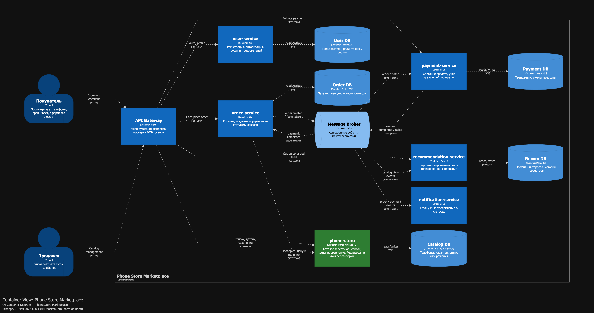

# Phone Store — Архитектурное проектирование маркетплейса

> Домашнее задание: C4 + инициализация сервисов  
> Тинькофф Образование · Шакирова Динара

---

## C4 Container Diagram



Реализован **Catalog Service** — Django-приложение, магазин телефонов.

| Контейнер | Технология | Описание |
|---|---|---|
| phone-store | Python 3.11 / Django 4.2 | Список, детали, сравнение телефонов |
| Catalog DB | SQLite3 | База данных товаров |

---

## Домены и ответственность

| # | Домен | Ответственность |
|---|---|---|
| 1 | Identity & Access | Регистрация, JWT, роли (buyer / seller / admin) |
| 2 | **Catalog** ← реализован | CRUD товаров, список, детали, сравнение |
| 3 | Order Management | Корзина, checkout, статусы заказа |
| 4 | Payments | Списание, транзакции, возвраты |
| 5 | Recommendations | Персонализированная лента, ML-ранжирование |
| 6 | Notifications | Email / Push по событиям |

---

## Распределение доменов по сервисам

| Домен | Сервис | Стек |
|---|---|---|
| Identity & Access | `user-service` | Python/FastAPI, PostgreSQL |
| **Catalog** | `phone-store` ← **этот репозиторий** | Python/Django, SQLite→PostgreSQL |
| Order Management | `order-service` | Python/FastAPI, PostgreSQL |
| Payments | `payment-service` | Python/FastAPI, PostgreSQL |
| Recommendations | `recommendation-service` | Python, MongoDB |
| Notifications | `notification-service` | Python/FastAPI, без БД |

**Логика разбиения:** каждый домен выделен в отдельный сервис, потому что у них принципиально разные характеристики нагрузки и жизненные циклы изменений. Каталог читается на порядки чаще, чем пишется — нужно независимое горизонтальное масштабирование. ML-рекомендации требуют Python-стека и не должны делить процесс с Django. Платёжный сервис требует строгой изоляции данных и аудит-лога.

---

## Границы владения данными

| Сервис | Данные | БД |
|---|---|---|
| `user-service` | Пользователи, роли, токены | PostgreSQL |
| `phone-store` | Телефоны, характеристики, изображения | SQLite / PostgreSQL |
| `order-service` | Заказы, позиции, история статусов | PostgreSQL |
| `payment-service` | Транзакции, суммы, возвраты | PostgreSQL |
| `recommendation-service` | Профили интересов, история просмотров | MongoDB |
| `notification-service` | — | — |

Разделяемых баз данных нет. Данные о телефонах доступны только через API `phone-store`.

### Взаимодействия сервисов

**Синхронные (REST/JSON):**
- Gateway → каждый сервис (маршрутизация запросов)
- `order-service` → `phone-store` (проверка цены и наличия)
- `order-service` → `user-service` (проверка профиля)

**Асинхронные (Kafka):**
- `order-service` публикует `order.created` → `payment-service` (инициация оплаты)
- `payment-service` публикует `payment.completed/failed` → `order-service` (смена статуса) + `notification-service`
- Просмотры каталога → `recommendation-service` (поведенческие сигналы)

---

## Варианты декомпозиции

### Вариант A: Микросервисы (выбранный)

6 независимых сервисов, каждый со своей БД, общение через REST и Kafka.

**Плюсы:**
- Каждый сервис масштабируется независимо (каталог — горизонтально, платежи — минимально)
- ML-рекомендации в отдельном Python-процессе без влияния на Django
- Изоляция отказов: падение `notification-service` не роняет checkout
- Независимый деплой каждого сервиса

**Минусы:**
- Распределённые транзакции требуют Saga-паттерна
- Сложная инфраструктура: Kafka, service discovery, distributed tracing
- Дополнительная latency на межсервисных вызовах (~20–40ms)

---

### Вариант B: Модульный монолит

Один Django-процесс, домены — это Django-приложения внутри одного проекта, одна общая БД.

**Плюсы:**
- ACID-транзакции без Saga
- Нулевая latency между модулями (прямые вызовы)
- Простота локальной разработки

**Минусы:**
- Нельзя масштабировать каталог отдельно от платежей
- Падение любого модуля роняет весь процесс
- ML-рекомендации (Python/NumPy) в одном процессе с Django — нестабильно
- Границы модулей со временем размываются

---

### Вариант C: BFF + два монолита (Buyer / Seller split)

`buyer-app` (каталог + заказы + рекомендации) и `seller-app` (управление товарами), общаются через события или shared БД.

**Плюсы:**
- Чёткое разделение по бизнес-роли
- Команды buyer и seller деплоят независимо

**Минусы:**
- Shared БД между двумя монолитами — антипаттерн, нарушение изоляции данных
- Платежи и уведомления относятся к обеим сторонам — неестественная граница
- Дублирование модели `Phone` в обоих монолитах

---

## Финальный выбор и обоснование

**Выбран Вариант A — Микросервисы.**

Требования кейса прямо определяют разные домены с несовместимыми характеристиками:

| Требование кейса | Следствие для архитектуры |
|---|---|
| Персонализированная выдача ленты | Отдельный ML-сервис (Python), нельзя в монолите с Django |
| Расчёт и учёт платежей | Строгая изоляция данных, отдельная БД, аудит-лог |
| Управление каталогом (для продавцов) | Независимое масштабирование чтения, возможность CDN |
| Уведомления о статусах заказов | Асинхронный консьюмер событий, не нужна своя БД |

Вариант B не подходит: невозможно масштабировать каталог без масштабирования платёжного модуля — нерационально по ресурсам. Вариант C не подходит: shared БД между `buyer-app` и `seller-app` — антипаттерн; при обновлении схемы `phones` нужно координировать деплой обоих монолитов.

---

## Запуск

```bash
docker compose up --build
```

Открыть в браузере: `http://localhost:8000`

| URL | Описание |
|---|---|
| `GET /health` | Health-check → `{"status":"ok"}` |
| `GET /phones/` | Список телефонов |
| `GET /phones/<id>` | Детали телефона |
| `GET /phones/compare` | Сравнение двух телефонов |
| `GET /admin/` | Django Admin |

```bash
docker compose down
```
